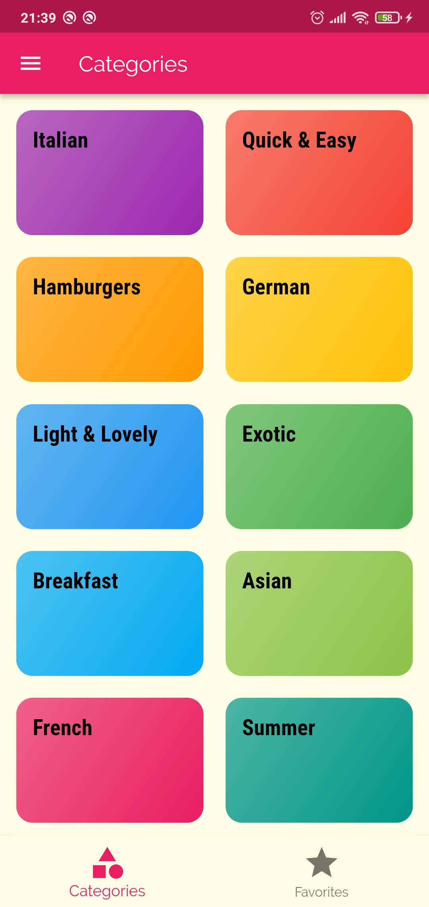
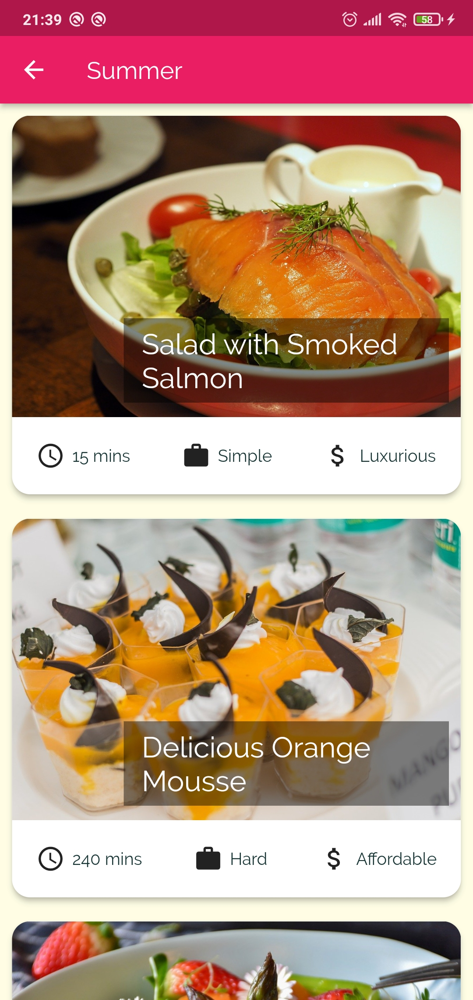
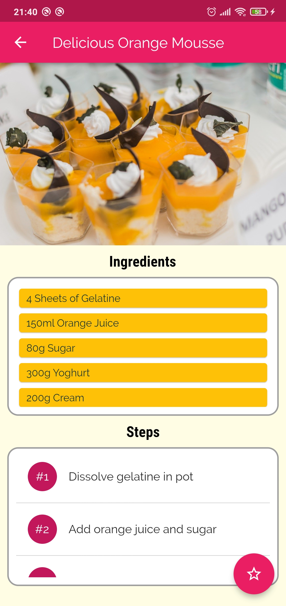
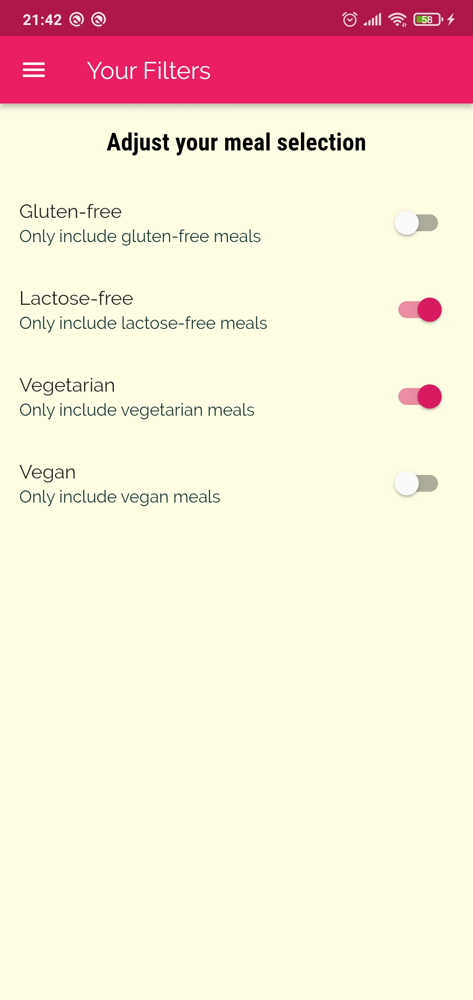

# cooking_recipe

Hi 🐋,  
Here is my second Flutter App  
Although nothing special, but the UI is much better!🌸   
I'm trying to achieve great things!

---

## Screenshots

    
    
    
    

    
    

